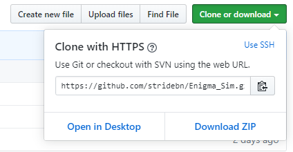
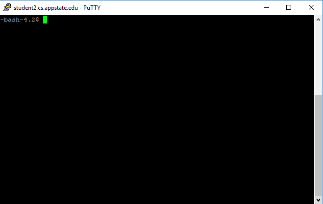
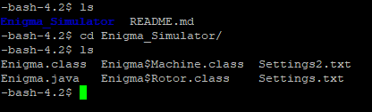
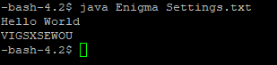
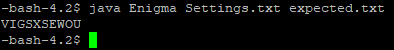
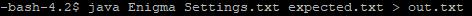

### Index
+ [Welcome](#welcome)
+ [Description](#description-of-enigma_sim)
+ [How To Use This](#how-to-use-this)
  + [Installation and Running](#installation-and-running)
    + [Executing](#executing)
    + [Formatting Settings](#formatting-settings)
+ [FAQ](#frequently-asked-questions)
+ [File Manifest](#file-manifest)
+ [Licensing](#licensing)
+ [Collaboration](#collaboration)
+ [Support](#support)

# Welcome!
This GitHub [repository](https://github.com/stridebn/Enigma_Sim) contains the source code for a Java Enigma Simulator, written by Brennan Stride, and documented with the help of Martin Hernandez-Gamez and Hunter Craig. To use the Simulator, download or clone the project (see [below](#how-to-use-this)).

## Description Of Enigma_Sim 
Enigma_Sim is a Java simulator for the Wehermacht Enigma, a German encryption device used primarily in World War II. The simulator is built to run with the terminal on a linux machine. It takes the input of a formatted .txt file (see [Formatting Settings.txt](#formatting-settings)) and outputs the encrypted or decrypted string, as given by another input file, or user input in the terminal.

## How To Use This
### Installing and Running
1. Clone or download this [repository](https://github.com/stridebn/Enigma_Sim)          
   
2. Open a terminal session (if an appstate student, use the student2 machine)         
   
3. Navigate to the directory Enigma_Simulator        
   
4. Run the executable (see [below](#executing))

#### Executing
Use the following command to execute the file `java Enigma Settings.txt`. It will wait for user input. Enter some text to encrypt, then press enter.    

+ To set up your own settings file, see [Formatting Settings](#formatting-settings)
+ To specify an input file, such as the included SampleText.txt, include it as a second argument, `java Enigma Settings.txt SampleText.txt`    

+ The executable accepts any .txt file as a settings file, but it must be properly formatted or the program will fail. If no .txt files are included in the execution statement, the program will fail.
+ To output to a text file, you can specify ` > out.txt` at the end of the execute statement, where out.txt could be any text file name (the statement will output a new file if the named one does not exist).     

#### Formatting Settings
There are two properly formatted settings files included in this program: [Settings.txt](https://github.com/stridebn/Enigma_Sim/blob/master/Enigma_Simulator/Settings.txt) and [Settings2.txt](https://github.com/stridebn/Enigma_Sim/blob/master/Enigma_Simulator/Settings2.txt). Include no additional whitespace except when explicitly mentioned below.
+ *Line 1*: Specifies the rotors in L-R orientation. INCLUDE DELIMITING SPACES
   + There are 5 possible rotors, 1 - 5. The original Enigma used a combination of 3 rotors, with no duplicates.
   + To specify rotor pattern 1, 5, 3 for example, the first line would be `1 5 3`
+ *Line 2*: Specifies the ring settings of the 3 rotors within the machine. INCLUDE DELIMITING SPACES
   + Formate as Line 1, L-R orientation, including only values 1 to 26, representing A-Z in the alphabet. The text `10 15 21` in the settings file corresponds to the ring setting letters `J O U`.
   + These ring settings provide a base offset to the Enigma's rotor wiring alignments (see [Enigma rotors](https://en.wikipedia.org/wiki/Enigma_machine#Rotors)). 
+ *Line 3*: Specifies the initial window letters of the machine. **DO NOT** INCLUDE DELIMITING SPACES
   + Specify 3 capital letters, without delimiting spaces, for example: `TRA`
+ *Line 4*: Specifies the reflector option. TYPE ONLY 'B' OR 'C' (without quotes) 
   + There are only two options, in line with the original M3 machine (see [Enigma reflector](https://en.wikipedia.org/wiki/Enigma_machine#Reflector))
+ *Line 5*: Specifies plugboard pairs. INCLUDE DELIMITING SPACES BETWEEN EACH PAIR OF LETTERS
   + The program will accept only a list of 10 pairs of letters. If there are any duplicates, the program may produce bad output. 
   + An example line 5: `OS NT RH BU LI DF GA QP CK JY`
   + For more information on the plugboard, see [here](https://en.wikipedia.org/wiki/Enigma_machine#Plugboard).

## Frequently Asked Questions
#### What is the Enigma?
   The [Enigma](https://en.wikipedia.org/wiki/Enigma_machine) was a machine used by Germany during the second world war to encrypt their  communications. This encryption changed daily and was considered impossible to be broken consistently by human codebreakers.      
#### Why would I use this?
   Use this program if:
   * You are interested in how the Enigma functions and want to see it in action
   * You have an interest in cryptography
   * You have an interest in WWII history    
#### Can I copy this for academic purposes?
   Absolutely! This project is licensed to be free to reproduce under the MIT license.    
#### What programming language is this written in?
   This project is written in entirely in java.     
#### Will I need a java IDE to compile?
   The class files are provided, so there is no need to compile.      
   
## File Manifest
+ [README.md](https://github.com/stridebn/Enigma_Sim/blob/master/README.md) :: the readme file
+ [Enigma_Simulator](https://github.com/stridebn/Enigma_Sim/tree/master/Enigma_Simulator) :: directory holding project files
  + `Enigma$Machine.class`      :: machine object class
  + `Enigma$Rotor.class`        :: rotor object class
  + `Enigma.class`              :: holds main method and static machine object
  + [Enigma.java](https://github.com/stridebn/Enigma_Sim/blob/master/Enigma_Simulator/Enigma.java) :: the java program itself
  + [Settings.txt](https://github.com/stridebn/Enigma_Sim/blob/master/Enigma_Simulator/Settings.txt) :: sample settings
  + [Settings2.txt](https://github.com/stridebn/Enigma_Sim/blob/master/Enigma_Simulator/Settings2.txt) :: sample settings 2
  + [SampleText.txt](https://github.com/stridebn/Enigma_Sim/blob/master/Enigma_Simulator/SampleText.txt) :: contains "Hello World"

## Licensing
This project is licensed under the MIT license. For more detail, read the [LICENSE](https://github.com/stridebn/Enigma_Sim/blob/master/LICENSE) file.

## Collaboration
If you wish to collaborate, this github repository is the place to do it. Contact <stridebn@appstate.edu> with any questions about specifics.
Some specific ideas for improvement:
+ GUI implementation
+ Executable (remove need for command line)
+ Write program for inputting settings (outputs correctly formatted text file)

## Support
Contact <hernandezgamezm@appstate.edu> with any technical support questions. (but *please* check the FAQ and instructions above first)
